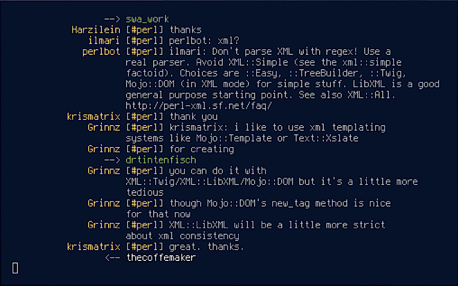

<!--
  Title: KISS for IRC (kirc)
  Description: A tiny IRC client written in POSIX C99.
  Author: mcpcpc
-->

<h3 align="center">
  
</h3>

<p align="center">KISS for IRC, a tiny IRC client written in POSIX C99.</p>

<p align="center">
  <a href="./LICENSE"></a>
  <a href="https://github.com/mcpcpc/kirc/releases"></a>
  <a href="https://repology.org/metapackage/kirc"></a>
  <a href="https://www.codacy.com/manual/mcpcpc/kirc/dashboard?utm_source=github.com&amp;utm_medium=referral&amp;utm_content=mcpcpc/kirc&amp;utm_campaign=Badge_Grade"></a>
</p>

<p align="center">
  
</p>

## Features

*   Excellent cross-platform compatibility (due to [POSIX](https://opensource.com/article/19/7/what-posix-richard-stallman-explains) standard compliance).
*   No dependencies other than a [C99 compiler](https://en.wikipedia.org/wiki/C99).
*   Native [SASL PLAIN and EXTERNAL](https://tools.ietf.org/html/rfc4422) authentication support.
*   [TLS/SSL](https://en.m.wikipedia.org/wiki/Transport_Layer_Security) protocol capable (via external TLS utilities).
*   Full chat history logging.
*   Multi-channel joining at server connection.
*   Simple shortcut commands and full support for all IRC commands in the [RFC 2812](https://tools.ietf.org/html/rfc2812) standard:

```shell
<message>                 Send a PRIVMSG to the current channel.
@<channel|nick> <message> Send a message to a specified channel or nick 
/<command>                Send command to IRC server (see RFC 2812 for full list).
/#<channel>               Assign new default message channel.
/?                        Print current message channel.
```

*   Color scheme definition via [ANSI 8-bit colors](https://en.wikipedia.org/wiki/ANSI_escape_code), allowing for uniform color definition across all shell applications.

## Installation & Usage

Building and installing on **KISS Linux** using the Community repository:

```shell
kiss b kirc
kiss i kirc
```

Building and installing on **Arch** and **Arch-based** distros using the AUR:

```shell
git clone https://aur.archlinux.org/kirc-git.git
cd kirc
makepkg -si
```

Building and installing from source (works on **Raspbian**, **Debian**, **Ubuntu** and many other Unix distributions):

```shell
git clone https://github.com/mcpcpc/kirc.git
cd kirc
make
make install
```

### Usage

Consult `man kirc` for a full list and explanation of available `kirc` arguments.

```shell
kirc [-s hostname] [-p port] [-c channels] [-n nickname] [-r realname] [-u username] [-k password] [-x command] [-w nick_width] [-W max_width] [-o logfile] [-e|v|V]
```

## Transport Layer Security (TLS) Support

There is no native TLS/SSL support. Instead, users can achieve this functionality by using third-party utilities (e.g. stunnel, [socat](https://linux.die.net/man/1/socat), ghosttunnel, etc).

### Example using `socat` 

Remember to replace items enclosed with `<>`.

```shell
socat tcp-listen:6667,reuseaddr,fork,bind=127.0.0.1 ssl:<irc-server>:6697
kirc -s 127.0.0.1 -c 'channel' -n 'name' -r 'realname'
```

## SASL PLAIN Authentication

In order to connect using `SASL PLAIN` mechanism authentication, the user must provide the required token during the initial connection. If the authentication token is base64 encoded and, therefore, can be generated a number of ways. For example, using Python, one could use the following:

```shell
python -c 'import base64; print(base64.encodebytes(b"nick\x00nick\x00password"))'
```

For example, lets assume an authentication identity of `jilles` and password `sesame`:

```shell
$ python -c 'import base64; print(base64.encodebytes(b"jilles\x00jilles\x00sesame"))'
b 'amlsbGVzAGppbGxlcwBzZXNhbWU=\n'
$ kirc -n jilles -a amlsbGVzAGppbGxlcwBzZXNhbWU=
```

## SASL EXTERNAL Authentication

Similar to `SASL PLAIN`, the `SASL EXTERNAL` mechanism allows us to authenticate using credentials by external means. An example where this might be required is when trying to connect to an IRC host through [Tor](https://www.torproject.org/). To do so, we can using third-party utilities (e.g. stunnel, [socat](https://linux.die.net/man/1/socat), ghosttunnel, etc).

### Example using `socat` 

Remember to replace items enclosed with `<>`.

```shell
socat TCP4-LISTEN:1110,fork,bind=0,reuseaddr SOCKS4A:127.0.0.1:<onion_address.onion>:<onion_port>,socksport=9050
socat TCP4-LISTEN:1111,fork,bind=0,reuseaddr 'OPENSSL:127.0.0.1:1110,verify=0,cert=<path_to_pem>'
kirc -e -s 127.0.0.1 -p 1111 -n <nick> -x 'wait 5000'
```

## Color Scheme Definition

Applying a new color scheme is easy! One of the quickest ways is to use an application, such as [kfc](https://github.com/mcpcpc/kfc), to apply pre-made color palettes. Alternatively, you can manually apply escape sequences to change the default terminal colors.

### Example using `kfc`

```shell
kfc -s gruvbox
```

### Example using ANSI escape sequences

```shell
printf -e "\033]4;<color_number>;#<hex_color_code>"

# Replace <hex_color_code> with the desired Hex code (e.g. #FFFFFF is white).
# Replace <color_number> with the one of the numbers below:
# 0 -  Regular Black
# 1 -  Regular Red
# 2 -  Regular Green
# 3 -  Regular Yellow
# 4 -  Regular Blue
# 5 -  Regular Magenta
# 6 -  Regular Cyan
# 7 -  Regular White
# 8 -  Bright Black
# 9 -  Bright Red
# 10 - Bright Green
# 11 - Bright Yellow
# 12 - Bright Blue
# 13 - Bright Magenta
# 14 - Bright Cyan
# 15 - Bright White
```

## Contact

For any further questions or concerns, feel free to reach out to me, [mcpcpc](https://github.com/mcpcpc), on `#kirc`
or `#kisslinux` channels of the _irc.freenode.org_ server.
